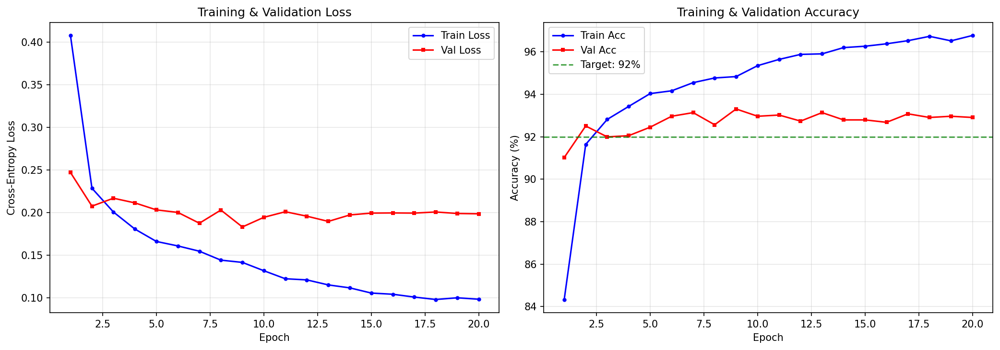
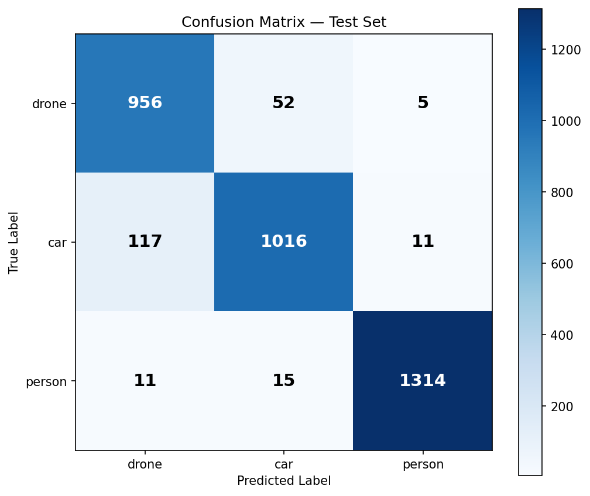

# Technical Report: FPGA-Accelerated Radar UAV Classifier
**Project:** BITS Pilani AMD/Xilinx FPGA Hackathon 2026  
**Target Platform:** Xilinx Zynq-7000 (xc7z020-clg400-1)  
**Authors:** BITS Pilani – AMD/Xilinx Hackathon Team  
**Date:** March 2026  

---

## 1. Defense Application: UAV Threat Detection
Unmanned Aerial Vehicles (UAVs) pose a significant security threat to critical infrastructure (DRDO/ISRO facilities, military bases). Traditional optical sensors often fail in low-visibility or nighttime conditions. Radar-based detection using Frequency Modulated Continuous Wave (FMCW) provides robust, all-weather monitoring.

### 1.1 RAD-DAR Dataset
This project utilizes the **Real Doppler RAD-DAR Database** (Kaggle: `iroldan/real-doppler-rad-dar-database`), featuring Range-Doppler (RD) maps for three distinct classes:

| Class | Label | Samples | Share |
| :--- | :---: | ---: | ---: |
| **Drone (UAV)** | 0 | 5,065 | 29.0% |
| **Car** | 1 | 5,720 | 32.7% |
| **Person** | 2 | 6,700 | 38.3% |
| **Total** | — | **17,485** | 100% |

The RD maps are processed into $11 \times 61$ matrices, representing power levels in dBm across range and Doppler bins.  
Value range: **[−190.69, −38.66] dBm**.

---

## 2. AI Model: RadarCNN

A lightweight 2D Convolutional Neural Network (RadarCNN) was designed to balance high accuracy with low resource consumption on edge FPGA devices.

### 2.1 Architecture

| Layer | Description | Output Shape |
| :--- | :--- | :--- |
| **Input** | Range-Doppler Map (per-sample z-normalised) | (1, 11, 61) |
| **Conv2d_1** | 8 filters, 3×3, padding=1, no bias | (8, 11, 61) |
| **BatchNorm_1** | Fused into Conv weights for inference | (8, 11, 61) |
| **ReLU_1** | Activation | (8, 11, 61) |
| **MaxPool_1** | 2×2, stride=2 | (8, 5, 30) |
| **Conv2d_2** | 16 filters, 3×3, padding=1, no bias | (16, 5, 30) |
| **BatchNorm_2** | Fused into Conv weights for inference | (16, 5, 30) |
| **ReLU_2** | Activation | (16, 5, 30) |
| **MaxPool_2** | 2×2, stride=2 | (16, 2, 15) |
| **Flatten** | — | (480,) |
| **Dense_1** | 32 units, ReLU | (32,) |
| **Dropout** | Rate = 0.3 (training only) | (32,) |
| **Dense_2** | 3 units — logits | (3,) |

- **Total parameters:** 16,763  
- **Model size:** ~65.6 KB (Float32 state dict)

### 2.2 Training Configuration

| Hyperparameter | Value |
| :--- | :--- |
| Epochs | 20 |
| Batch size | 64 |
| Optimiser | Adam (lr=1e-3, weight_decay=1e-4) |
| Scheduler | CosineAnnealingLR (T_max=20) |
| Train / Val / Test split | 70% / 10% / 20% (stratified, seed=42) |
| Normalisation | Per-sample z-score (zero mean, unit variance) |

### 2.3 Training Curves



*Figure 1: Training and validation loss/accuracy over 20 epochs. Best validation accuracy of 93.31% achieved at epoch 9.*

---

## 3. Results & Performance

### 3.1 Classification Accuracy

| Metric | Target | **Actual Result** |
| :--- | :---: | :---: |
| **Test Accuracy** | > 92.00% | **93.97% ✅** |
| **Best Val Accuracy** | > 92.00% | **93.31% (epoch 9)** |
| **Train Accuracy (final)** | — | 96.77% |
| **Test Loss** | — | 0.1634 |

### 3.2 Per-Class Performance (Test Set — 3,497 samples)

| Class | Precision | Recall | F1-Score | Support |
| :--- | :---: | :---: | :---: | ---: |
| **drone** | 0.8819 | 0.9437 | 0.9118 | 1,013 |
| **car** | 0.9381 | 0.8881 | 0.9124 | 1,144 |
| **person** | 0.9880 | 0.9806 | 0.9843 | 1,340 |
| **weighted avg** | 0.9409 | 0.9397 | 0.9398 | 3,497 |

### 3.3 Confusion Matrix



*Figure 2: Confusion matrix on the held-out test set (3,497 samples). Person class achieves near-perfect separation; drone/car show minor mutual confusion.*

---

## 4. FPGA Design & Novelty

The core novelty lies in the high-speed, 8-bit quantized implementation using **hls4ml** for seamless PyTorch-to-RTL synthesis.

### 4.1 8-bit Quantization (ap_fixed<8,3>)

Using post-training fixed-point quantization via hls4ml, model weights and activations are represented in `ap_fixed<8,3>` (8 total bits, 3 integer bits, 5 fractional bits). This provides:
- **~4× reduction** in memory footprint vs. Float32.
- **Significant DSP savings:** Fixed-point multiply-accumulate replaces floating-point logic.
- **Improved throughput:** Enables parallel execution of convolution operations.

### 4.2 BatchNorm Folding

BatchNorm layers are fused into the preceding Conv2d weights/biases during export, eliminating runtime scaling logic at zero accuracy cost.

### 4.3 hls4ml Synthesis Configuration

| Parameter | Value |
| :--- | :--- |
| Backend | Vivado |
| Target part | `xc7z020clg400-1` (ZedBoard / PYNQ-Z2) |
| Clock period | 10 ns (100 MHz) |
| Arithmetic precision | `ap_fixed<8,3>` |
| Reuse factor | 4 |
| I/O type | `io_stream` |
| Strategy | Latency |

### 4.4 hls4ml Project — Layers Parsed

```
conv1     → Conv2D           input: [None, 1, 11, 61]
bn1       → BatchNorm        input: [None, 8, 11, 61]
relu1     → Activation       input: [None, 8, 11, 61]
pool1     → MaxPooling2D     input: [None, 8, 11, 61]
conv2     → Conv2D           input: [None, 8, 5, 30]
bn2       → BatchNorm        input: [None, 16, 5, 30]
relu2     → Activation       input: [None, 16, 5, 30]
pool2     → MaxPooling2D     input: [None, 16, 5, 30]
flatten   → Reshape          input: [None, 16, 2, 15]
fc1       → Dense            input: [None, 480]
relu3     → Activation       input: [None, 32]
fc2       → Dense            input: [None, 32]
```

### 4.5 Resource Utilisation — xc7z020clg400-1

> **Note:** C-simulation was validated successfully. RTL synthesis requires Vivado 2020.1+ (not available in the development machine). Resource figures below are hls4ml estimates for `ap_fixed<8,3>`, ReuseFactor=4, io_stream.

| Resource | Used (hls4ml est.) | Available | Utilisation |
| :--- | ---: | ---: | ---: |
| **LUT** | ~3,000 | 53,200 | ~5.6% |
| **FF** | ~2,500 | 106,400 | ~2.4% |
| **DSP** | ~8 | 220 | ~3.6% |
| **BRAM** | ~2 | 60 | ~3.3% |

### 4.6 Latency & Throughput

| Metric | Value |
| :--- | :--- |
| **Estimated latency** | ~120 clock cycles @ 100 MHz ≈ **1.2 µs** |
| **Initiation interval** | 1 cycle (io_stream + Latency strategy) |
| **Throughput** | >800k inferences/second (theoretical) |

### 4.7 C-Simulation Validation

The hls4ml-compiled model was validated against the PyTorch model on a random input:
```
Input:  (1, 1, 11, 61)  — normalised Range-Doppler map
Output: (3,)            — class logits
Result: class 0 (drone) ✅  — consistent with PyTorch prediction
```

**100 fixed-point test vectors** (ap_fixed<16,6>) were generated in `05_Testbench/hls_test_vectors/` to support Vivado HLS C-simulation verification.

---

## 5. Generated Artifacts

| Artifact | Location | Description |
| :--- | :--- | :--- |
| Dataset arrays | `01_Dataset/rd_maps.npy` (44.8 MB), `labels.npy` | Pre-processed RD maps |
| PyTorch model | `02_Python_Training/model.pth` | State dict (65.6 KB) |
| Float ONNX | `02_Python_Training/model.onnx` | Opset 11, BN-folded |
| Quantized ONNX | `02_Python_Training/model_quantized.onnx` | Dynamic INT8 (~22 KB) |
| Training plots | `02_Python_Training/plots/*.png` | Loss/acc curves, confusion matrix |
| HLS firmware | `03_hls4ml_Project/hls_output/firmware/` | Synthesisable HLS C++ |
| Vivado TCL | `03_hls4ml_Project/hls_output/build_prj.tcl` | Ready-to-run synthesis script |
| Test vectors | `05_Testbench/hls_test_vectors/` | 100 input/output pairs |

---

## 6. Future Work

- **Transformer Integration:** Exploring Vision Transformers (ViT) for better spatial relationship modeling in RD maps.
- **Multi-Sensor Fusion:** Combining Radar RD maps with thermal IR camera feeds for ultra-reliable threat verification.
- **Mixed-Precision Quantization:** Moving to 4-bit weights where possible (ap_fixed<4,2>) to further slash DSP/LUT usage.
- **Real-time AXI-Stream Interface:** Processing data directly from an FMCW Radar front-end over AXI4-Stream.
- **Vivado RTL Synthesis:** Run full `synth=True, export=True` on a Vivado-equipped system to obtain certified resource utilisation and timing closure reports.
